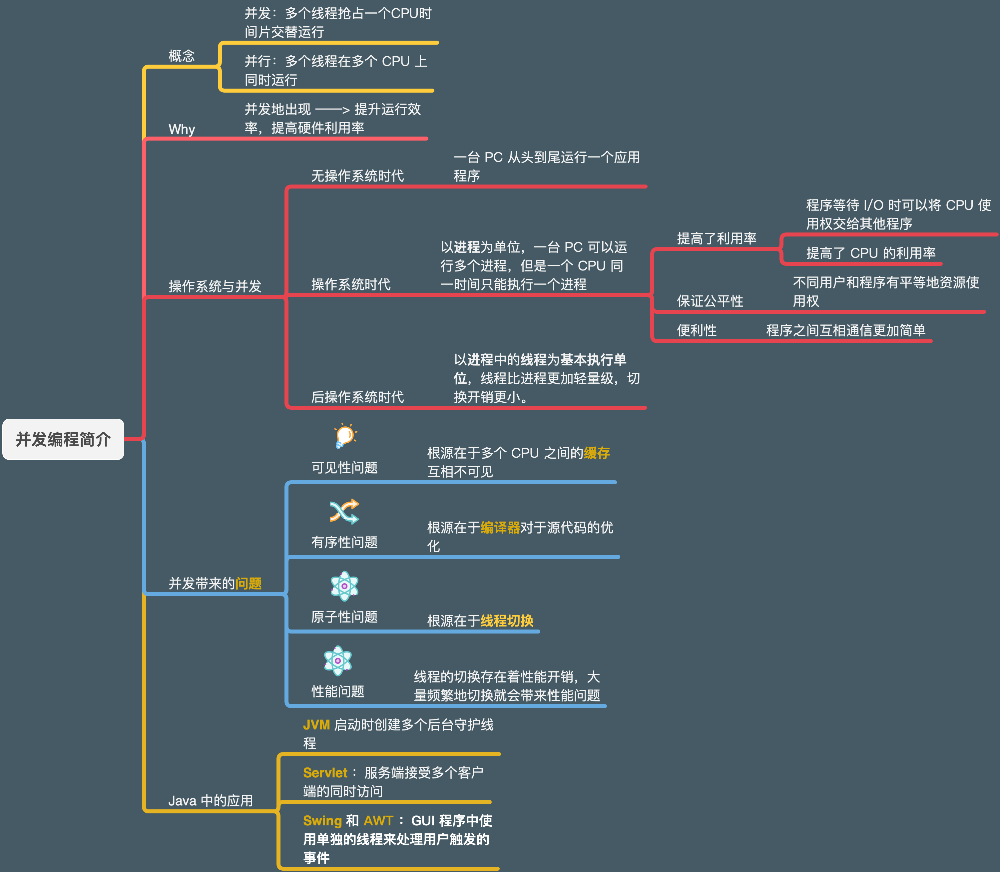

## 《Java 并发编程实战第一章》


### 读之前先问自己：

**为什么有并发**（`多线程`的作用）：

1. 将`复杂的异步`代码简化为一组`同步`的多线程代码

2. 利用`多核CPU`，提高程序`效率`

**引入并发带来的问题**：

- **线程安全性：**
  - **有序性**
  - **可见性**
  - **原子性**
- **性能问题**：大量线程频繁切换带来的额外开销

**典型的并发应用场景：**

- **Web服务器**
- **Servlet 容器**
- **RMI(Remote Method Invocation）远程方法调用**

`Java`内置的解决**线程安全性**的`关键字`：

- 关键字 `synchronized`（**内置锁**/**互斥锁**，重型同步手段，）

- 关键字 `volatile`（`轻量级`同步手段，解决`内存可见性`问题）

### 1.1 并发简史


<p align="center">
  
  <br/>
</p>


`操作系统`出现之前，也就是**早期的计算机不包含操作系统**，在这种`裸机环境`中很难编写和运行程序，并且整个计算机从头到尾只能执行一个程序，这个程序访问计算机中的所有资源，这对于资源来说也是一种浪费。

**操作系统出现之后，计算机能同时运行多个程序**，并且不同程序都在单独的`进程`中运行：操作系统为各个独立执行的进程分配各种资源，包括`内存`，`文件句柄`以及`安全证书`等。

并且各个`进程之间`可以进行一些粗粒度的`通信`机制来`交换数据`，包括`套接字`、`信号处理器`、`共享内存`、`信号量`以及`文件`等。

**操作系统出现的原因**（为什么要有操作系统）：

- **资源利用率**：在某些情况下，程序必须等待某个外部操作执行完成。例如输入输出的 `IO` 操作等，而在等待时程序无法进行其他工作。因此如果在`等待的同时运行另一个程序`，则`提高了资源的利用率`。
- **公平性**：不同的用户和程序对于`计算机`上的`资源`有着`相同的使用权`。 一种高效的运行方式是通过`粗粒度`的**`时间分片`**（`Time Slicing`）使这些用户和程序能共享计算机资源，而不是由一个程序从头到尾运行，再启动下一个程序。
- **便利性**：通常来说，计算多个任务时应编写多个程序，每个程序执行一个任务并在必要时通信将数据汇总。这比只编写一个程序来计算所有任务更容易实现。【类似`分布式`的计算】

【关于这三个促使线程出现的原因，**`并发编程网`** 的一个小例子帮助我理解】：

<p align="center">
  
  <br/>
</p>


> **`资源利用率更好`** ：
>
> 想象一下，一个应用程序需要从本地文件系统中读取和处理文件的情景。比方说，从`磁盘`读取一个文件需要`5`秒，`处理`一个文件需要2秒。处理两个文件则需要：

```java
有一个任务：
5秒读取文件A

2秒处理文件A

5秒读取文件B

2秒处理文件B

---------------------

总共需要14秒

```

> 而当`读取`的时候使用`多线程`可以`切换到其他线程处理`这个文件，于是`使用多线程`变成了下面的顺序

```java
5秒读取文件A

5秒读取文件B + 2秒处理文件A // 这两个动作可以同时进行，因为读取文件是硬盘I/O 而 此时 CPU 可以同时处理文件

2秒处理文件B

---------------------

总共需要12秒
```

> `CPU` 等待第一个文件被读取完，然后开始读取第二个文件。
>
> 当第二个文件被读取的时候，`CPU` 会去处理第一个文件。
>
> 在 `等待磁盘读取文件`时，`CPU`大部分时间是 `空闲` 的。也就是这时如果不让`CPU` 去做别的事儿，则白白`浪费`了 `CPU` 的时间片。
>
> 总的来说，`CPU` 能够在 `等待IO` 时做其他的事情，这个 IO 不一定特制 `磁盘IO`。 也可以是 `网络IO` ，`用户输入`。
>
> 通常情况下，`网络和磁盘IO` 比 `CPU` 和 `内存的I/O` **慢得多**。
>
> 
>
> **`程序设计更简单：`**：
>
> 【这里的简单并不是指多线程简单，而是使用多线程`分解复杂任务`之后比写一个`复杂的异步任务`简单】
>
> 在`「单线程」` 应用程序中，如果想编写程序 **「手动处理」** 上面提到的 `「读取」` 和 `「处理」` 的顺序，你必须记录 `「每个文件」` 和 `「处理状态」`。
>
> 当你使用`多个线程`时，可以启动两个线程，每个线程`处理`一个文件和`读取`操作。
>
> `线程`会在等待`磁盘读取`文件的过程中被`阻塞`。 在等待过程中，其他线程能够使用 `CPU` 去处理已经读取完的文件。
>
> **结果就是**：`磁盘I/O 总是在繁忙的读取不同的文件到内存中`，这会带来 `CPU 利用率`的**提升**。而且每个线程值需要记录一个文件，因此这种方式比编写一个复杂的单线程任务也更`简单`。
>
> **`程序响应更快：`**：
>
> 将一个`单线程应用`程序变为`多线程应用`程序的另一个常见目的就是为了`提升响应速度`。
>
> 如果一个服务器是单线程，它在某个端口监听请求，当请求到来时，它去处理请求，然后再返回监听，服务器流程如下：

```java
// 当服务正在运行时
while(servier is active) {
	// 监听请求
	listen for request;
	// 处理请求
	process request;
}
```

> 
>
> 如果某个请求占用了大量的时间，在这段时间内新的客户端无法发送请求给服务端。`只有服务器在监听时，请求才能被接收`。 
>
> **这就是`单线程服务器`的弊端。**
>
> 另一种设计是：`监听线程`只负责监听，同时存在一个专门处理业务逻辑的`工作者线程`(`worker thread`)。 监听线程获取到请求之后将请求传递给工作者线程，然后继续监听。
>
> 而工作者线程能够处理这个请求并发送一个回复给客户端，关于这种设计的伪代码：

```java
while (server is active) {
  	listen for request;
  	hand request to worker thread;
}
```

> 这样，`服务端线程`能迅速地返回监听，因此客户端收到的响应速度也会更快。
>
> `「桌面应用」`也是如此，如果你点击一个按钮开始运行任务，当任务运行时点击整个窗口没有反应，我想你一定任务是这个程序出了问题，下一秒也许就该强制结束这个进程了。
>
> 而多线程的桌面应用则可以在执行任务时，`窗口线程`也可以自由地响应其他用户的请求。
>
> 对用户而言，这种具有`工作者线程`设计的程序显得响应速度更快。

**【以上内容来自：**[并发编程网—多线程的优点](http://ifeve.com/benefits/)，我对于内容作了一部分修改，使例子更紧凑。】

做事高效的人总能在`串行性`与`异步性`之间找到合理的`平衡`，程序也是如此。

**这三个促进进程出现的因素，同样也促进线程出现。**【为了更细粒度的掌控资源，就有了线程】

`线程`允许在**同一个`进程` **中同时存在**多个 `程序控制流` **。线程 `「共享」` 进程 范围**内**的 `资源`，例如`内存`句柄和`文件`句柄，但在每个线程中都有各自的`程序计数器（Program Counter）`、`栈`以及`局部变量`等。

`线程`还提供了一种直观的分解模式来充分利用多处理器系统中的硬件并行性，而在**同一个程序**中的**多个线程**也可以被**同时调度**到**多个 CPU 上运行**。

**【这里就要配上 `Java` 的 `JMM 内存模型`了，这张图很明确的说明了进程中哪些是线程之间共享的资源，哪些是线程内线程自己使用的资源 ↓  ** **JMM 内存模型**  来自**《深入理解 Java虚拟机 第三版》** 】

<p align="center">
  
  <br/>
</p>

`线程`也被称为`轻量级的进程`，同时在**现代操作系统**上，大多数都以`线程`为`基本调度单位`，而不是进程。

如果没有明确的**`协同机制`**，那么`线程`将**独立执行**。

**同一个`进程`中的所有`线程``共享`进程的`内存地址空间`**，因此这些**`线程`**都能访问相同的变量并在`同一个堆`上分配对象，这就需要实现一种比在`进程空间`内`共享数据`粒度更`细`的**`数据共享`**机制。

如果没有明确的**同步机制**来`协同`对`共享数据`的**访问**，那么当一个`线程`正在使用某个变量时，另一个线程可能`同时访问`这个变量，这将造成`不可预测`的结果。

【也就是另一个线程访问到的其实是错误的变量，这个变量正在被更改 这种并发产生的问题称为 **`竞态条件`**】

### 1.2 线程的优势

在使用得当的前提下，线程可以有效降低开发和维护成本，同时`提升`复杂应用程序的`性能`。

**线程能够将大部分的异步工作流转换成串行工作流**，因此能更好地模拟人类的工作方式和交互方式。使用 多线程：将`复杂的异步`程序改为`一组`简单的`串行`程序 。

【**2020年03月19日23:36:53  下午去看的是 OnJava8 的编程章节，看了一会实在受不了了，太晦涩了，还是继续看 Java 编程实战吧。**】

在`图形界面`中，`线程`提高用户界面的`响应灵敏度`，线程还可以降低代码复杂度，使代码更加容易编写、阅读、和维护。

`服务器程序`中，线程简化  `JVM` 的实现，**`垃圾收集器`**通常在**一个或多个专门的线程中运行**。许多重要的 Java 应用程序都在一定程度上用到了`线程`。


#### 1.2.1发挥多核处理器的强大能力

因为`基本调度单位`是线程，如果程序中只有一个线程，则最多只能在一个处理器上运行。

现在的`CPU核心`数量越来越多，单线程意味着`浪费`CPU计算能力。

使用`多线程`可以`提高`单处理器系统上的`吞吐率`，因为当程序发生`阻塞`的时候，可以`切换`到别的线程继续运行。


#### 1.2.2 建模的简单性

通常来说，当只需要执行`相同类型的任务`时（比如修改12个错误）在时间管理方面要比执行`多种类型的任务`（修复错误，面试系统管理员接任者，指定团队绩效考核）要简单。

当只有一种类型的任务需要完成时，只需要埋头工作即可，不需要花费精力琢磨下一步做什么，并且如果需要完成`多种类型`的任务，就需要管理不同任务之间的`优先级`和执`行时间`，也可能需要在`任务之间`进行`切换`，这会带来额外的`开销`。

对于软件来说同样如此：如果在程序中只包含一种类型的任务，那么比包含多种不同类型的任务的程序要更容易编写，错误更少，也更容易测试。如果为模型中每种类型的任务都分配一个专门的线程，就可以形成一种串行执行的假象，并将程序的执行逻辑与调度机制的细节交替执行的操作，异步 I/O 以及 资源等待等问题分离开。

通过使用线程可以将`复杂的异步工作流`分解为一组`简单并且同步的工作流`，每个工作流在`单独的线程`运行，并在特定的`同步位置`进行`交互`。

通过一些现有的框架可以实现上述目标，例如 `Servlet` 和 `RMI`（`Remote Method Invocation` 远程方法调用）。 

框架负责解决细节问题，例如：

- `请求管理`
- `线程创建`
- `负载均衡`
- 在正确的时刻将请求分发给正确的应用程序组件

对于开发人员来说，使用 Servlet 时不需要了解有多少请求在同一时刻被处理，也不需要了解套接字的输入流或输出流是否被阻塞。

当调用 `Servlet` 的 `service` 方法响应 `Web` 请求时，就可以用同步的方式来处理这个请求，就像单线程程序那样。 这种方式简化了组件的开发，并缩短了这种框架的学习时间。**【因为框架屏蔽掉了复杂的，底层的处理，让开发者只需要以同步的方式编写 API 就可以享受到多线程的便利性】**

`Servlet` 与 `RMI 框架`使用了多线程技术。

#### 1.2.3异步任务的简化处理

服务器应用程序在接受来自多个远程客户端的`套接字`连接请求时，如果为`每个连接`都分配各自的线程并且使用`同步 I/O`，那么就会降低这类程序的开发难度。

如果某个应用程序对`套接字`执行读操作，而此时数据还没有到达，那么这个读操作将一直`阻塞`，直到有数据到达。而这种阻塞的读操作在`单线程应用程序`中意味着`无法`对其他请求进行处理。

为了避免 `I/O` 阻塞，`单线程服务器`应用程序必须使用`非阻塞 I/O`（`NonBlocking I/O`） `这种I/O很复杂`复杂性远高于同步 `I/O` ，并且很容易出错。

如果每个请求都有自己的处理线程，就可以`将非阻塞I/O简化为同步I/O`。**（相当于简化了IO的复杂性，但是也引入了多线程的复杂性）**

早期的操作系统会对进程可创建的线程数量作一个比较严格的限制，大约在`数百个`（`甚至更少`）。

因此，操作系统提供了一些高效的方法来实现`多路 I/O`，例如 `Unix` 的 `select` 和 `poll` 等系统调用，要调用这些方法 Java 类库需要获得一组实现`非阻塞 I/O` 的包（`java.nio`)。

然而，在现代操作系统中，进程中可创建的线程数量已得到了极大的提升，这使得在某些平台上，即使有更多的客户端连接需求，为每个连接分配一个咸城铁也是可行的。①

> **`注解①`**： `NPTL` 线程软件包专门设计用于支持数十万个线程，大多数 `Linux 发行版`中都包含了这个软件，`非阻塞 I/O` 有其自身的优势，但是如果操作系统能更好的地支持线程，那么使用`非阻塞 I/O` 的场景会变得更少。


### 1.3 线程带来的风险

虽然线程有上述优点，但是引入一个技术必然也带来了相应的问题，线程亦是如此。虽然 `Java` 提供给了相应的类库（`JUC`）以及明确的跨平台内存模型【也就是 Java 内存模型】，但是多线程的引入还是提高了对 Java 开发人员的技术要求，因为在更多的程序中会使用线程，而如果对并发没有掌握的话，会出现很多莫名其妙的问题。


#### 1.3.1 多线程安全性问题

> `程序清单 1-1` 非线程安全的数值生成器

```java
@NotThreadSafe
    public class UnsafeSequence {
    		private int value;
    
        /**返回一个唯一的数值*/
    		public int getNext() {
    	      return value++;    
        }
    }
```


<p align="center">
  
  <br/>
</p>


这里可能导致`2条线程`同时操作变量 `value`。因为 `value++` 并非**`原子操作`**，它由3部分组成：

1. **读取** `value`的值
2. **操作** `value`的值 + 1
3. **写入** `value` 的值

当2个线程同时读取了`value = 9`时， 这个情况下的`value` 的时候，就会造成问题，它们得到了相同的值，并都将这个值 `+1`.结果就是在**不同的线程的调用中返回了相同的数值**。


这里书里定义了3个`自定义注解`：

- **`@NotThreadSafe`** ： 标明该类是线程不安全的类。
- **`@ThreadSafe`** ： 标明该类是线程安全的类。
- **`@Immutable`** ： 标明该类或字段是不可变的。


在上面的 `UnsafeSequence` 中说明的是一种常见的**「并发安全」**问题：`竞态条件（Race Condition）`。

在多线程环境下， `getValue`  是否会返回唯一的值，取决于运行时线程的交替方式，而这种方式具有`随机性`，这不是我们想看到的结果。

多个线程共享相同内存地址空间（同个进程的内存地址空间），并且线程是并发运行的，因此它们可能会`访问`或`修改` **其他线程**正在使用的变量。这个特性的好处是`线程之间的通信更加方便`，带来的`风险`则是：线程会因为`无法预料的数据变化`而发生错误。

`Java` 中提供了各种**同步机制**的协同访问来解决这个问题。

以下就是线程安全的数值生成器，修复了上面的 UnsafeSequence 中存在的错误：

> `程序清单 1-2` 线程安全的数值生成器:

```java
@ThreadSafe
public class Sequence {
  @GuardedBy("this") 
  private int Value;
  public synchronized int getNext() {
    return Value++;
  }
}
```

这里使用了互斥锁来保证`同时只有一个线程`可以进入 `getNext` 方法中，于是也就不存在多个线程同时操作 `Value` 这个值的情况了。


#### 1.3.2 活跃性问题

开发并发代码时，**`安全性`**是不可破坏的，**`安全性`**对于**多线程**和**单线程程序**同样**重要**。

此外，线程还会导致单线程中不会出现的问题，比如：**`活跃性`**。

**`安全性`**：永远不发生糟糕的事情。

**`活跃性`**：某件正确的事情最终一定会发生。

当某个操作无法继续的时候，就会发生活跃性的问题。在**`串行程序`**中，**`死循环`**就是一个`活跃性`问题，**循环之后**的代码无法被执行。

在`多线程`中的其`他活跃性`问题：`线程A` 等待 `线程B` 释放资源，而 `线程B` **永远不释放**该资源，那么A就会一直等待下去。<---【`死锁`】

**第十章介绍各种形式的活跃性问题。以及如何避免这些问题，包括 死锁，饥饿，活锁。**

**导致活跃性问题的错误总是难以分析的**，因为它们依赖于不同线程的事件发生时序，因此在开发或测试中并不总是能够复现。


#### 1.3.3 性能问题

与活跃性问题相关的是性能问题，活跃性意味着某件正确的事情最终会发生，但我们通常希望这件事`尽快`发生。

性能问题包括很多方面：`服务响应时间过长`、`响应不灵敏`、`吞吐率过低`、`资源消耗过高`、`可伸缩性差`等。

线程的引入也会带来相应的性能问题：`线程之间`上下文`频繁切换`带来的`开销`。在多线程程序中，当线程调度器临时挂起活跃线程并转而运行另一个线程时，就会频繁出现上下文切换操作，这种操作会带来很大的开销：保存和`恢复执行上下文`、`丢失局部性`，`CPU` 会花费更多的时间在`线程调度`而不是`线程运行`上。

而在多线程环境中我们通常需要使用同步机制来保证线程的安全性，线程的**同步机制**会**`抑制`**某些编译器优化，**使缓存区中的数据无效**，**增加共享内存总线的同步流量**。

这些因素都将带来**`额外开销`**，**十一章**讲怎么**`分析`**和**`减少`**这些开销。

### 1.4 线程无处不在

- `Timer`
- `Servlet`
- `RMI` 远程方法调用
- `Swing` 和 `AWT Java` 图形界面工具

**使用多线程，就必须熟悉并发性和线程安全性。**


<p align="center">
  
  <br/>
</p>


### 个人补充：

本章作为本书的开篇章节，概述了并发出现的背景，以及并发带来的利与弊，阐述了几个典型的多线程应用。

但是只给了结论，并没有给具体的论述过程，我的希望就是能把这一部分补上，并且绘制一些抓重点的图片，总结重点知识。


#### Java与线程对应的代码：

### 主线程

1、Java 中的主线程：每个Java应用程序都有一个 Main() 函数，这个函数所在的线程就是主线程，每启动一个主线程，就启动了一个新的 JVM实例。

**当我启动 IDEA 时，由于该IDE是使用 Java编写的，所以此时已经启动了一个 JVM实例。**

<p align="center">
  
  <br/>
</p>


**此时我再启动一个类的Main方法，看看系统中会不会再多出一个 java 进程：**

<p align="center">
  
  <br/>
</p>


<p align="center">
  
  <br/>
</p>


<p align="center">
  
  <br/>
</p>

<p align="center">
  
  <br/>
</p>


**可以看到，每当我启动一个新的主线程，系统中就多了一个JVM实例。**


### Thread 类 与 Runnable 接口：

`Java`中对线程这个概念的实现是 `Thread` 类，新启动一个`线程`有两种方式：

- 继承 `Thread` 类
- 实现 `Runnabnle`接口

```java
public class ThreadTest {
    public static void main(String[] args) {
        System.out.println("主线程："+Thread.currentThread().getName());
        // 两种不同的启动新线程的方法
        new Thread(new MyThread()).start();
        new MyThread2().start();
    }
}

// 实现接口
public class MyThread implements Runnable{
    @Override
    public void run() {
        System.out.println("子线程："+Thread.currentThread().getName());
    }
}

// 继承 Thread 类
public class MyThread2 extends Thread {
    @Override
    public void run() {
        System.out.println("子线程："+Thread.currentThread().getName());
    }
}

```

这里的 `run` 方法并不是让程序员调用的，而是`start` 之后 当线程获得 CPU时间分片之后执行 `run` 方法中的具体业务逻辑。

如果我们没有使用 `start` 而是 `run`，那么就没有启动一个新的线程，而只是在当前线程中调用了 `run` 方法而已。 例如下面这样：

```java
public class ThreadTest {
    public static void main(String[] args) {
        System.out.println("主线程："+Thread.currentThread().getName());
        // 在 main 线程中调用了 MyThread 中的 run方法，并没有启动一个新线程
        new MyThread().run();
    }
}
```


### 本章对应的代码与TestCase：

- 1、非线程安全的计数器Servlet
  - 代码：https://github.com/funnycoding/java_learning/blob/master/java_concurrency_in_practice/src/main/java/chapter1/UnsafeCountingFactorizer.java
  - 测试用例：https://github.com/funnycoding/java_learning/blob/master/java_concurrency_in_practice/src/test/java/chapger1/UnsafeCountingFactorizerTest.java 
- 2、线程安全的计数器
  - 代码：https://github.com/funnycoding/java_learning/blob/master/java_concurrency_in_practice/src/main/java/chapter1/SafeSequence.java
  - 测试用例：https://github.com/funnycoding/java_learning/blob/master/java_concurrency_in_practice/src/test/java/chapger1/UnsafeCountingFactorizerTest.java 


### 本章总结：

作为本书的第一章，从宏观上介绍了并发的由来以及引入并发随之而来的问题，并没有很多的细节，所以只做一个大概的了解即可，后面章节会有更多的细节，并且更深入的对并发带来的问题，以及使用并发的正确方法做介绍。


### 对应的脑图（增加了发散的知识）


<p align="center">
  
  <br/>
</p>


#### 下面的脑图对应本章知识内容总结：


<p align="center">
  
  <br/>
</p>


