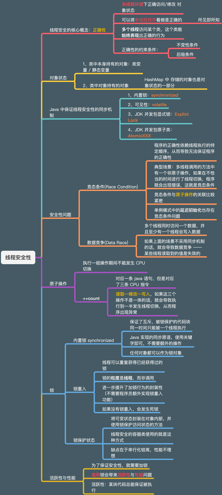

## 《Java 并发编程实战第二章》 —— 线程安全性

### 什么是线程安全性

- **线程安全性：**在多线程环境下访问某个类的**①共享** **②可变**状态，该类自始至终能够表现出`正确`的行为。

- **线程安全的核心概念**：**正确性**。

  - **正确性的约束条件**：`不变性条件`、`后验条件`。

- **对象状态**：

  - **类字段** —— 类中声明一个 `HashMap` 的引用，这个 `HashMap` 对象本身就是这个类的状态之一
  - **类持有对象内部所持有的对象** —— `HashMap` 的 `Entry.Set` 中保存的对象，也属于持有 `HashMap` 类的状态

  

**程序清单2-1 无状态的 `Servlet`**

下面这个 `Servlet` 是**线程安全**的，因为类中**不存在任何的共享可变的状态**，所以即使在**多线程环境下**也不会出现安全问题。

```java
@ThreadSafe
public class StatelessFactorizer implements Servlet {
  BigInteger i = extractFromRequest(req);
  BigInteger[] factors = factor(i);
  encodeIntoResponse(resp,factors);
}
```

### 原子性

- **原子性**：一组在执行过程中不会发生线程切换的操作，称之为**原子操作**。
  - **重点**：原子操作的**粒度**在 `CPU` 时间片而**不是在高级编程语句**。
    - 例： 定义了一个 `int` 类型变量的计数器 `count` ，在方法中对 `count` 进行递增的语句： `++count;` 
    - 这条语句虽然在高级语言中是一行，但是其中包含了3个 `CPU` 执行动作：**读取——修改——写入**，而在这每个动作执行的过程中都可能发生线程切换，从而导致程序数据异常。
- 怎样保证**原子性**：**加锁 —— 互斥**。
- 非原子操作带来的线程安全问题：
  - **竞态条件**：程序执行的正确性依赖某种特定的时序。
    - 典型场景：**单例模式，延迟初始化。**
- **复合操作**：对应多个 `CPU` 执行单元的动作，例如上面的 `++count`，对应 3 个 CPU 操作，符合操作如果不使用同步机制保证原子性，就会带来`竞态条件`问题。

`程序清单2-2` 没有同步的情况下统计已处理请求数量的 Servlet（线程不安全，存在竞态条件） 

```java
@NotThreadSafe
public class UnSafeContingFactorizer implements Servlet {
  // 计数器，可变状态
  private long count = 0;
  
  // 获取计数器的当前值
  public long getCount() {
    return count;
  }
  
  public void service(ServletRequest req, ServletResponse resp) {
    BigInteger i = extractFromRequest(req);
    BigInteger[] factors = factor(i);
    // 这里就是一个典型的复合操作，同时这个方法并没有采取任何同步措施，会导致竞态条件发生，程序可能会发生异常
    ++count;
    encodeIntoResponse(resp,factors);
  }
  
}
```


**`程序清单2-3`  延迟初始化中的竞态条件（不要这么做）**

```java
@NotThreadSafe
public class LazyInitRace {
  // 单例对象
  private ExpensiveObject instance = null;
  
  public ExpensiveObject getInstance() {
    if (instance == null) {
      // 这里可能同时有两个线程进入，从而导致程序异常
      instance = new ExpensiveObject();
    }
    return instance;
  }
}
```


**`程序清单2-4`  使用原子类解决之前的竞态条件**

```java
@ThreadSafe
public class CountingFactorizer implements Servlet {
  private final AtomicLong count = new AtomicLong(0);
  
  public long getCount() {
    return count.get();
  }
  
  public void service(ServletRequest req, ServletResponse resp) {
    BigInteger i = extractFromRequest(req);
    BigInteger[] factors = factor(i);
    // 一个原子的递增操作，不会产生竞态条件问题
    count.incrementAndGet();
    encodeIntoResponse(resp,factors);
  }  
}
```


### 加锁机制

- **Java 内置的锁**：`synchronized` 关键字。
  - **锁对象**：任意 `Object`。
  - **作用**：保证了互斥，被锁修饰的代码块中的临界区同时只有一个线程可以进入。
  - **同步原语**：有很强的封装性，不需要额外的处理，使用 `synchronized` 关键字，加锁解锁操作由编译器自动添加，不需要程序员手动处理。
  - **锁重入**：**获得锁的线程可以重复获得锁 —— 进一步提升了封装性**，不需要做额外的处理，如果锁不可重入会导致**`死锁`**问题。
- **Java 内置关键字**： `volatile`，**不保证能互斥，只保证可见性**，背后是底层的 `JMM` 内存模型中的 `Happens-Before` 规则支撑。

### 用锁来保护状态

因为**锁**可以保证**互斥**与**独占**访问，所以将状态封装在类中，然后将访问状态的方法加锁就可以保证状态的安全性。

**简单的小例子：**

```java
class SynchronizedDemo {
  // 要被保护的状态，使用 private 将其封装在类中
  private int counter;
  
  // 使用加锁的get/set 方法保证状态的安全性
  public synchronized addCounter() {
    ++counter;
  } 

  public synchronized getCounter() {
    return counter;
  }
}
```

**这里需要注意的点是，修改状态与读取状态的锁需要`是同一个锁对象`。**如果锁对象不同，就无法保证互斥，从而可能导致问题。

这种方法的缺点就是没有强行的机制去确保这种加锁协议的延续性，所以只能靠文档进行说明，所以这种加锁协议很容易被破坏。


**`程序清单 2-5` 该 Servlet 在没有足够的原子性的情况下对其最近计算结果进行缓存**

```java
@NotThreadSafe
public class UnsafeCachingFactorizer implements Servlet {
  // 下面是两个原子变量，虽然单独使用可以保证线程安全，但是如果放在一起使用而没有别的同步措施则未必安全
  private final AtomicReference<BigInteger> lastNumber = new AtomicReference<BigInteger> ();
  private final AtomicReference<BigInteger[]> lastFactors = new AtomicReference<BigInteger[]> ();
  
  public void service(ServletReqeust req, ServletResponse resp) {
    BigInteger i = extractFromRequest(req);
    if (i.equals(lastNumber.get()) {
      encodeIntoResponse(resp, lastFactors.get());
    } else {
      BigInteger[] factors = factor(i);
      // -------- 下面是分别使用两个原子变量的语句，但是这两个语句组合在一起是一个复合语句，并不是原子的，可能刚执行完第一句，就发生了线程切换，同时数据发生变化，再次切换回来之后继续执行第二句，最后导致了数据的异常
      lastNumber.set(i);
      lastFactors.set(factors);
      // --------------------
      encodeIntoResponse(resp,factors)''
    }
  }
}
```


### 活跃性与性能

锁的引入保证了线程安全性，但是同时也带来了活跃性与性能问题。如果没有分析好作用域而滥用锁的话，会导致程序非常严重的串行化，从而导致性能下降。

比如 Servlet 的设计场景就是从并发场景设计的，真正的使用场景也是服务端同时处理多个请求的场景，但是如果在 Servlet 中编写业务代码的同事使用了大量的锁，就可能导致整个程序串行化，每次只能处理一个请求，这样就会带来性能与活跃性问题。

**对应的解决方法就是使用细粒度锁，锁的范围越小，对性能的影响越低，所以要明确需要使用锁的地方并将其最小化。**


### 本章完整代码与对应 TestCase：


### 总结

第一遍看的时候真是感觉信息量好大，这学了一圈再加上三刷、四刷之后发现不断压缩本章的核心内容的话，压缩之后的话这一章的内容也就还好，更多的也是偏概念上的，还没有真正开始深入讲 Java 中对应的实现，或者只是提了个概念。

同时我对**极客时间的《Java 并发编程实战》**这门课的内容的**感官也在不断的变化**。

最开始只是觉得是这本书的下位替代，但是现在觉得也并不尽然。

其中包含了很多易懂的示例图，给出的代码也比书中仅是片段的要好一些，最重要的是深挖到了比较通用的并发编程解决范式比如管程模型 & 信号量，再到管程中的几个模型具体的介绍，哪怕只是个引子，也能让你明白该往什么方向去探究。

总的来说还是挺有价值的。


### 脑图：

<p align="center">
  
  <br/>
</p>